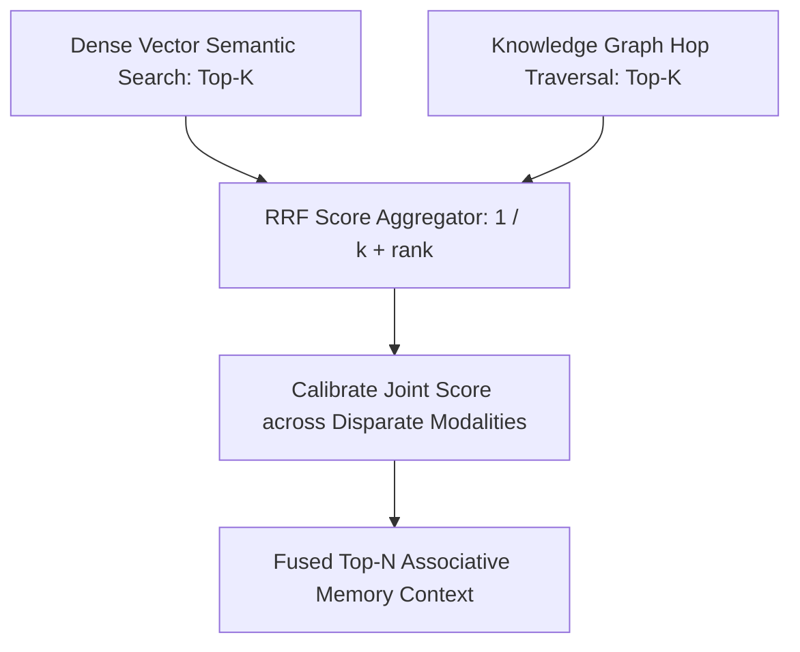

# GenPark AI Agent Skill - Vector Graph Hybrid Reciprocal Rank Fusion

Combines dense vector semantic similarity with graph hop proximity using standard Reciprocal Rank Fusion (RRF).

Verified by [GenPark AI](https://genpark.ai) and compatible with [Model Context Protocol (MCP)](https://genpark.ai/mcp).

## Architecture Diagram

## Features
- **Distribution-Agnostic Fusion**: Blends score spaces without requiring calibration normalization.
- **Zero External Dependencies**: Pure Python 3.9+ standard library.
